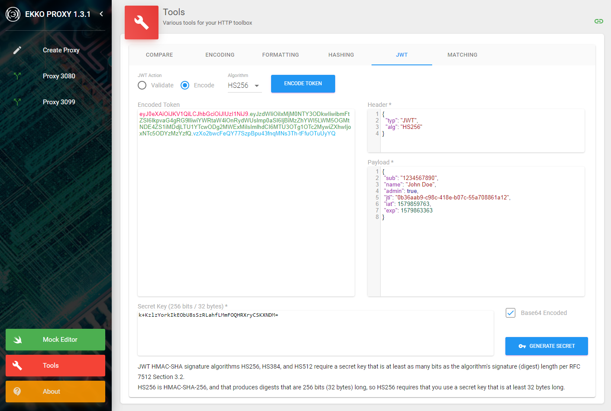

# Ekko Proxy JWT Encoder and Validation tool

The Ekko Proxy JWT tool allows you to encode or validate JWT (signed) tokens safely on your machine without you having to rely on potentially insecure online equivalent tools.

JWT Tool Screenshot:

The supported JWT signing algorithms are: HMAC-SHA (HS256, HS384, HS512), RSASSA-PKCS (RS256, RS384, RS512), ECDSA (Elliptic Curve - ES256, ES384, ES512), and RSASSA-PSS (PS256, PS384, PS512).

Ekko Proxy includes tools to encode/decode, format, match, and hash data, validate / encode JWT tokens - all safely from your local machine or server without the inherent dangers of using similar online tools.

Please see [Ekko Proxy GitHub](https://github.com/lcasoft/ekkoproxy) or [Ekko Proxy Home Page](https://www.ekkoproxy.com) for further details on how to install and use.
